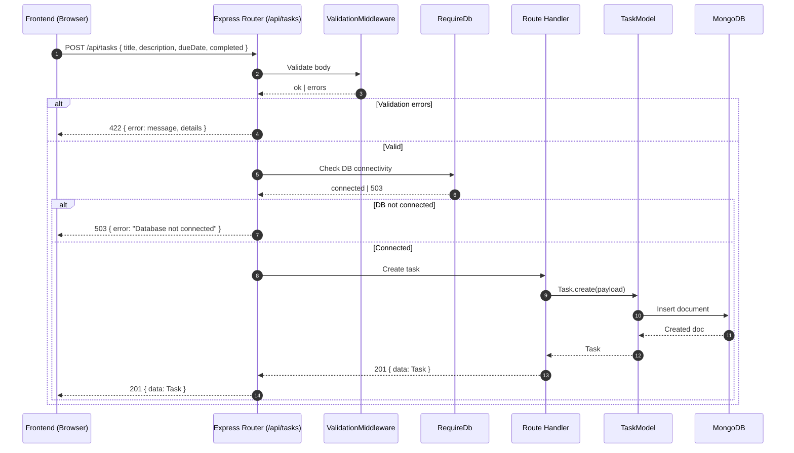

# Task Manager with RESTAPI

Simple, production-ready RESTful API built with Node.js, Express.js, MongoDB (Mongoose), and express-validator. Includes a minimal frontend to demonstrate CRUD, comprehensive error handling, environment-based configuration, CORS, security headers, tests, and graceful shutdown.

## Features
- CRUD for tasks: create, list, get by id, update, delete
- Async/await handlers, centralized error middleware
- Input validation with `express-validator` returning `422` with details
- Env-driven config with `dotenv` and CORS origin
- Security headers via `helmet`
- Health endpoint reporting DB connectivity
- Jest + Supertest + mongodb-memory-server tests
- Simple static frontend (HTML/JS/CSS) exercising the API

## Tech Stack
- Node.js 18+
- Express 4
- Mongoose 8
- express-validator 7
- helmet, cors, dotenv
- Jest, Supertest, mongodb-memory-server

## Project Structure
```
src/
  app.js                 # Express app, middleware, routes, static
  server.js              # Bootstraps env, starts server, connects DB, shutdown
  config/db.js           # Mongoose connect and connectivity helper
  middlewares/           # errorHandler, requireDb, validate
  models/task.model.js   # Task schema
  routes/task.routes.js  # CRUD routes
public/
  index.html, app.js, styles.css  # Demo UI
tests/
  tasks.e2e.test.js      # End-to-end API tests
.env                     # Environment variables (ignored by git)
.gitignore               # Excludes secrets and noise
package.json             # Scripts and deps
```

## Getting Started
1. Clone the repo and install dependencies:
```
npm install
```
2. Create `.env` (example):
```
PORT=4000
MONGODB_URI=mongodb://127.0.0.1:27017/tmrapi
CORS_ORIGIN=http://localhost:4000
```
3. Start MongoDB (Windows examples):
- Installed service: `net start MongoDB`
- Or Docker: `docker run -d --name tmrapi-mongo -p 27017:27017 mongo:7`
4. Start the API:
```
npm run start
```
5. Open the demo UI:
```
http://localhost:4000/
```
6. Health check:
```
GET http://localhost:4000/health  => { ok: true, dbConnected: true }
```

## API
Base URL: `http://localhost:4000`

- POST `/api/tasks`
  - Body: `{ title: string, description?: string, completed?: boolean, dueDate?: ISO8601 }`
  - 201 `{ data: Task }` or 422 with validation details

- GET `/api/tasks`
  - 200 `{ data: Task[] }`

- GET `/api/tasks/:id`
  - 200 `{ data: Task }` or 404 if not found; invalid id → 422

- PUT `/api/tasks/:id`
  - Body: same fields as POST, all optional
  - 200 `{ data: Task }` or 404; validation errors → 422

- DELETE `/api/tasks/:id`
  - 204 on success; 404 if not found

### Example cURL
```
curl -X POST http://localhost:4000/api/tasks \
  -H "Content-Type: application/json" \
  -d '{"title":"Write tests","description":"API validations"}'

curl http://localhost:4000/api/tasks

curl -X PUT http://localhost:4000/api/tasks/<id> \
  -H "Content-Type: application/json" \
  -d '{"completed":true}'

curl -X DELETE http://localhost:4000/api/tasks/<id>
```

## Middleware & Error Handling
- `helmet`, `cors`, `express.json()` in `src/app.js`
- `requireDb` returns `503` until DB is connected
- `runValidation` converts `express-validator` failures to `422` JSON
- `errorHandler` centralizes Mongoose/validator/other errors

## Testing
Run the test suite:
```
npm test
```
What’s covered:
- Create/list/get/update/delete flows
- Validation errors and invalid IDs
- Not found scenarios

## Security & Config
- No secrets are committed; `.env` is ignored by git
- CORS origin is configurable via `CORS_ORIGIN`
- Graceful shutdown closes Mongoose on `SIGINT`/`SIGTERM`

## Frontend Demo
- Served from `public/` via `express.static`
- Uses `fetch` to call the API
- Demonstrates listing, creating, updating, toggling `completed`, and deleting tasks

## Ready for GitHub
- Clean install and tests: `npm ci && npm test`
- Suggested CI: run `npm ci` and `npm test` on pushes/PRs
- Push steps:
```
git init
git add .
git commit -m "Task API with tests and demo UI"
git branch -M main
git remote add origin <YOUR_REMOTE_URL>
git push -u origin main
```

## Architecture Diagram

```mermaid
classDiagram
direction TB

class ExpressApp
ExpressApp : +use(middleware)
ExpressApp : +listen(port)

class TasksRouter
TasksRouter : +POST /api/tasks
TasksRouter : +GET /api/tasks
TasksRouter : +GET /api/tasks/:id
TasksRouter : +PUT /api/tasks/:id
TasksRouter : +DELETE /api/tasks/:id

class HealthEndpoint
HealthEndpoint : +GET /health

class StaticFrontend
StaticFrontend : +index.html
StaticFrontend : +app.js

class IValidation
<<interface>> IValidation
IValidation : +run(req)

class IErrorHandling
<<interface>> IErrorHandling
IErrorHandling : +handle(err, req, res)

class IDbConnectivity
<<interface>> IDbConnectivity
IDbConnectivity : +isConnected()

class ValidationMiddleware
class ErrorHandler
class RequireDb

class TaskModel
TaskModel : +String title
TaskModel : +String description
TaskModel : +Boolean completed
TaskModel : +Date dueDate

class Mongoose
Mongoose : +connect(uri)
Mongoose : +disconnect()

class MongoDB
class Helmet
class CORS
class JSONParser

ExpressApp --> TasksRouter : mounts /api/tasks
ExpressApp --> HealthEndpoint : health
ExpressApp --> StaticFrontend : serves /public

TasksRouter --> ValidationMiddleware : uses
TasksRouter --> ErrorHandler : propagates errors
TasksRouter --> RequireDb : guards
TasksRouter --> TaskModel : CRUD

TaskModel --> Mongoose : ODM
Mongoose --> MongoDB : connection

ValidationMiddleware ..|> IValidation
ErrorHandler ..|> IErrorHandling
RequireDb ..|> IDbConnectivity

ExpressApp ..> Helmet : security
ExpressApp ..> CORS : cors
ExpressApp ..> JSONParser : json
```

## Request Flow (POST /api/tasks)


